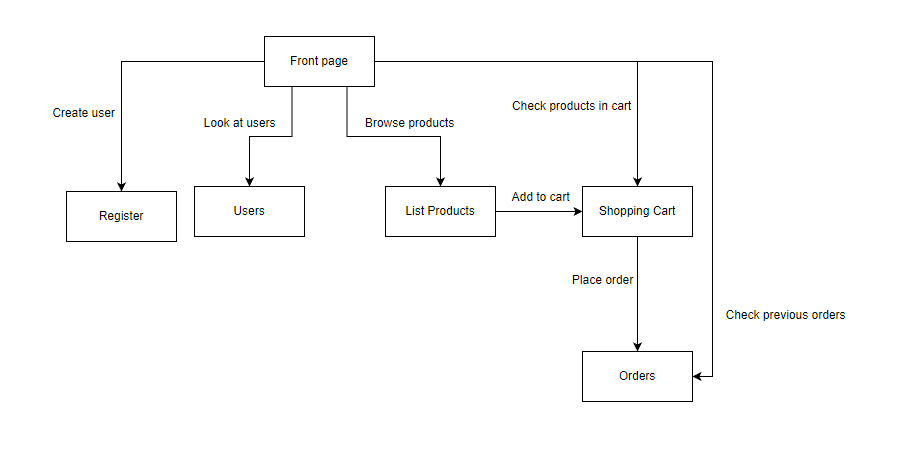

## Node project structure

......
## Data models
Order model:
Has CustomerId with type string
Items that contain product and quantity of said product:
Quantity is string and product has attributes id(String), name(String), price(number), and description(String).

Products model:
Has String name, Number price, String image and String description.

User model:
Has String name, String email, String password that is hashed and String role.

## Pages and navigation

## Tests and documentation
Project plan is first to implement the back-ended functionaly and test it with the local graders. After that implement the functionality to the website so users can use them. 
Image of the webserver in UML:

Implementation plan follows the same order that is present in testing. 

For product first we need to create database similarly how the user database was created.
After that:

1. Implementing GET for single product.
2. Updating or PUT for single product.
3. Delete for single product.
4. POST or creating a new product.

When we get to orders we need to create new database for them too
After that:

1. Get all orders.
2. Get a single order.
3. Create a new order.

After that we should have created all the back-end functionality.

Front-end plan

1. Create a new page for orders. It would be a new HTML page available in the store.
2. Add delete, modify and add product to products page.
3. Detail page for orders.
4. Make placing order to actually store the order.
5. Testing to see that everything works.

Implementation and testing:

I created the databases for orders and products in a similiar manner to that of the user database.
Orders database proved to be a bit trickier than the products because it would need to contain products.

Product implementation followed similiar steps to the user functionality. First I produced the code in request handle and
moved it, after test passed, to products.js. Same way user code was moved.

There could still be improvements in products.js and users.js because both have repeat code that could be located in a function.

Tested databases with reset-db.js script and with local test. It seemed the local test would not want to run if the order database was not working properly.

Back end implementations started with checking requirements with test and coding some and running the tests.
This way I completed the back-end. Also previous code proved to be helpful.

With Front-end I started by copying products HTML as orders and modifying it to my need because I thought it could work similarly.
After I got the information to the site I moved to products page.

Here I added delete, modify and add product following what was done in adminUser.js.

Then I needed to create the detail portion of the orders. I also used adminUser.js for this.
And after that I connected place order to store the order and send it to orders page.

Testing was done manually trying different actions on the site. For example adding new product. Moving it to shopping cart and placing an order.
Then checking if the order has been added to orders page.

## Security concerns

TODO: list the security threats represented in the course slides.
Document how your application protects against the threats.
You are also free to add more security threats + protection here, if you will.

Man-In-The-Middle attack:
The server is http So it does not provide protections against this kind of attack

Cross-Site Scripting (XSS):
Store validates some inputs. Also it would be good if the store would encode user inputs
and also html element text. 

Information Leakage:
Passwords are hashed so that protects somewhat against information leakage.

Authentication and Authorization:
Store protects agaings unauthorized access by checking authentication header and throwing authChallenge if its missing
or if user information is incorrect.

Session Management:
I don't think that the store does much agains session management.

SQL Injection:
Using mondodb prevents against traditional sql injections.

Cross-Site Request Forgery (CSRF):
All methods are not permitted for every action. 

_Good luck and happy group workin'!_
